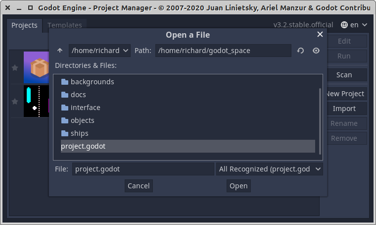
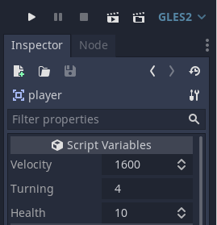
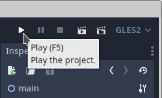
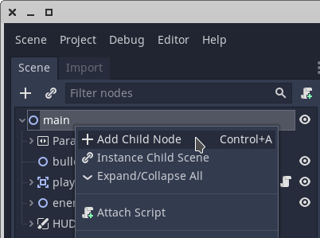
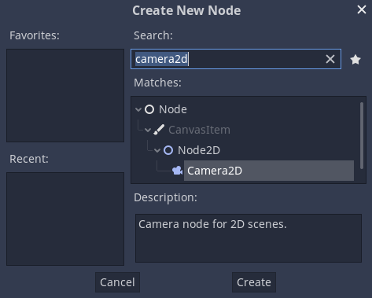

# Space Shooter Tutorial

Download the starter project from [https://electronstudio.github.io/godot_space/godot_space1.zip](https://electronstudio.github.io/godot_space/godot_space1.zip).

Unzip it.  Open Godot.  `Import` the `project.godot` file.



Run the game.  You should have a spaceship sprite that can turn left and right.

There is also lighting and a HUD.

## Player movement

This code is in `player.gd`.  __You do not need to type this, it has already been typed for you!__ Make sure you understand it before you continue.

_Which line moves the player?_

_What is `delta`?_

_How many times per second does the code run?_

```gdscript
extends Area2D

export var velocity = 0
export var turning = 4.0
export var health = 10

var Bullet = preload("res://player_bullet.tscn")
var score = 0

func _process(delta):
	if Input.is_action_pressed("turn_left"):
		rotation -= turning * delta
	if Input.is_action_pressed("turn_right"):
		rotation += turning * delta
	if Input.is_action_just_pressed("fire"):
		Bullet.instance().init(self, 4000)

	position += Vector2.RIGHT.rotated(rotation) * velocity * delta
```

## Velocity 

{width=5cm}  {width=5cm} 

When a script `exports` a variable we can change the value using the Inspector without editing the script.

Change the `velocity` of the `player` to 1600 in the node inspector. Run the game.


## Camera

We need a camera to track the player.  Add a `Camera2D` node to the `player` node.

{width=6cm} {width=7cm}

In the node inspector set:

* Current: On
* Zoom x: 6
* Zoom y: 6
* Drag Margin:
    * Left: 0
    * Right: 0
    * Top: 0
    * Bottom: 0


*What happens if you change these values?*
        
## Background
   
We would like to add another layer to the scrolling background.

1. Add a child node to the`ParallaxBackground` node.  The child node should be a `ParallaxLayer`.

2. Click on the `ParallaxLayer2`.

3. In the node inspector, set:
    * Motion: Mirroring x: 15360
    * Motion: Mirroring y: 15360
    
3. Find `backgrounds/stars_big_1024.png` in the filesystem (Bottom left of screen).

4. Drag into the scene in the centre of the screen.

5. Click on the `stars_big_1024` sprite node.

6. In the node inspector, under `Node2D` `Transform` set:
    * Position x: 7680
    * Position y: 7680
    * Scale x: 15
    * Scale y: 15

Run the game to verify it works.

## Particle effect

The player already has a `CPUParticles2D` node made for you.  Click on it.  In the Inspector, set:

* Emitting: On
* Amount: 50

Experiment with changing these settings.  *What do they do?*

* Lifetime
* Spread
* Gravity
* Velocity
* Color
* Anything else you like


## Make enemy move

Open the `enemy.tscn` scene file by double clicking it.

Right click on the `enemy` node and attach a script.  Replace the contents of the script with:

```gdscript
extends Area2D

export var VELOCITY = 1000.0
export var TURNING = 0.7
export var FIRE_RATE = 0.01

var Bullet = preload("res://enemy_bullet.tscn")
onready var player = get_node("/root/main/player")

func _process(delta):
	var d = player.position.angle_to_point(position) 
	rotation = Util.rotate_toward(rotation, d, TURNING*delta)
	position += Vector2.RIGHT.rotated(rotation) * VELOCITY * delta

	if position.distance_to(player.position) > 7000:
		queue_free()

	if randf()<FIRE_RATE:
		Bullet.instance().init(self, 3000)
```

## Add more enemies

NOTE: The `Light2D` node under `HUD` covers the whole screen with an invisible object (the light) and that makes it difficult to select other sprites because you
always accidently select the light.  I suggest you click the eye icon next to `Light2D` to hide it. But don't forget to unhide it once you have
finished positioning your sprites!

In the `main` scene, duplicate (ctrl-D) the enemy node a few times and try changing the exported variables in the node inspector so they move at different velocities. _Can you make a more deadly enemy this way?_

Also try changing `Node2D` `Transform` `Rotation`.

Test the game again.

## Make bullets move

Try pressing space to shoot bullets.  *What happens?  Why?*

We already have scene files for the bullets: `player_bullet.tscn` and `enemy_bullet.tscn`.

They are both attached to the same script file, `bullet.gd`.  Double click the file to edit the script and add this function:

```gdscript
func _process(delta):
	position += Vector2.RIGHT.rotated(rotation) * velocity * delta
	if position.distance_to(player.position) > 5000:
		queue_free()
```

Test the game again.  *Why are we testing the distance from the player?*

## Make bullets collide

1. Open the `player_bullet.tscn` scene file by double clicking it.

1. Click `bullet` node.

2. In the inspector click `Node` at the top to view the signals.

3. Double click the `area_entered` signal.

4. Select `bullet` from the list of nodes to connect to.

5. Click `connect`.

6. Godot will create an empty function for you.  Replace it with this:
    
```gdscript
func _on_bullet_area_entered(area):
	queue_free()
```

7. Repeat steps 1-5 for `enemy_bullet.tscn` scene.  (No need to edit the script and add the function again, since it's the same script and you already did it.)

8. Test the game again.


## Make enemy collide

1. Open the `enemy.tscn` scene file by double clicking it.

1. Click `enemy` node.

2. In the inspector click `Node` at the top to view the signals.

3. Double click the `area_entered` signal.

4. Select `enemy` from the list of nodes to connect to.

5. Click `connect`.

6. Godot will create an empty function for you.  Replace it with this:
    
```gdscript
func _on_enemy_area_entered(area):
	$explosion.play()
	$AnimationPlayer.play("fade")
	$CollisionPolygon2D.queue_free()
	$CPUParticles2D.emitting = true
	$CPUParticles2D.show()
	player.score += 1
	get_node("/root/main/HUD/score").text = str(player.score)
	yield(get_tree().create_timer(1.0), "timeout")
	queue_free()
```

Test the game again.

## Make player collide

1. Go back to the `main.tscn` scene (should be open as a tab).

1. Click `player` node.

2. In the inspector click `Node` at the top to view the signals.

3. Double click the `area_entered` signal.

4. Select `player` from the list of nodes to connect to.

5. Click `connect`.

6. Godot will create an empty function for you.  Replace it with this:
    
```gdscript
func _on_player_area_entered(area):
	health -= 1
	get_node("../HUD/health").value = health
	if health <= 0:
		get_tree().reload_current_scene()
	$crash_sound.play()
	modulate = Color(1000, 0, 0, 255)
	yield(get_tree().create_timer(1.0), "timeout")
	modulate = Color(1, 1, 1, 255) 
```

Test the game again.


## Gamepad controls (optional)

This is only required if you want to play to play with a gamepad.

Open `player.gd` script.  Delete the `gamepad` function and replace it with this:

```gdscript
var virtual_stick_direction = Vector2.ZERO

func gamepad(delta):
	var input = Vector2(Input.get_joy_axis(0, 0), Input.get_joy_axis(0, 1)) + virtual_stick_direction
	if input.length() > 0.2:
		var direction = input.angle()
		rotation = Util.rotate_toward(rotation, direction, turning * delta) 
```

## Touch screen controls (optional)

This requires the gamepad code above to have been added.  If you have a mobile phone or tablet this will allow you to
play on the touch screen.

Add to `player.gd` script:

```gdscript
var virtual_stick_origin = Vector2.ZERO

func _input(event):
	if event is InputEventScreenTouch:
		if event.position.x < get_viewport().size.x/2.0:
			if event.pressed:
				virtual_stick_origin = event.position
		else:
			if event.pressed:
				Input.action_press("fire")
			else:
				Input.action_release("fire")
	elif event is InputEventScreenDrag and event.position.x < get_viewport().size.x/2.0:
		virtual_stick_direction =  (event.position - virtual_stick_origin).normalized()
```
## More types of enemies

## Enemy spawner

```gdscript
extends Timer

export (PackedScene) var  Enemy
export var MAX_ENEMIES = 10
export var MAX_SCORE = 999999
export var MIN_SCORE = 0
onready var player = get_node("/root/main/player")

func _on_enemy_spawner_timeout():
	if get_child_count() < MAX_ENEMIES && player.score <= MAX_SCORE && player.score >= MIN_SCORE:
		var enemy = Enemy.instance()
		add_child(enemy)
```

## Enemy randomize

Add this to `enemy.gd` to randomize the position of the enemies when they spawn.

```gdscript
func _ready():
	position = player.position + Vector2.RIGHT.rotated(rand_range(0, PI*2)) * 5000
	rotation = player.position.angle_to_point(position) 
```

## Charge laser

Note this laser only has two states and so could have been done more simply using a boolean, but I wanted to demonstrate use of `enum`
because in future you might have more than two states.

```gdscript
extends Area2D

var charge = 0.0

enum  {CHARGING, DISCHARGING}
var laser = DISCHARGING

func _process(delta):
	if Input.is_action_just_pressed("fire") and charge < 0.01:
		laser = CHARGING
	if Input.is_action_just_released("fire"):
		laser = DISCHARGING
	if laser == CHARGING:
		charge += delta
	elif laser == DISCHARGING:
		charge -= delta
		if charge > 0.3:
			show()
			monitorable = true
		else:
			hide()
			monitorable = false
	charge = clamp(charge, 0.0, 3.0)
	get_node("/root/main/HUD/charge").value = charge
```

## Title screen

*Can you add a title screen to the game?*  Here are some hints.

Create a new scene called `title.tscn`.  Put your title screen text and graphics here.

Attach this script to the root node to start the game when player presses space.

```gdscript
extends Node2D

func _process(delta):
	if Input.is_action_just_pressed("fire"):
		get_tree().change_scene("res://main.tscn")
```

When the player dies, execute this code to switch to the title screen:

    get_tree().change_scene("res://title.tscn")